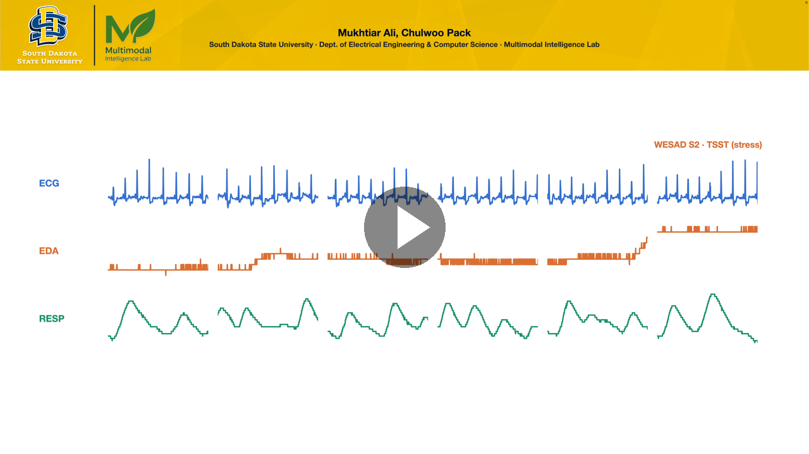
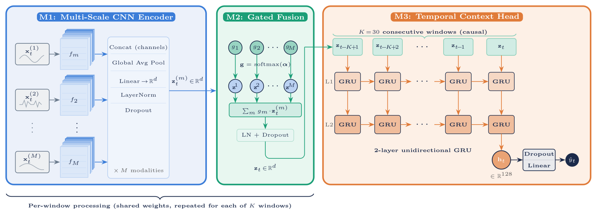
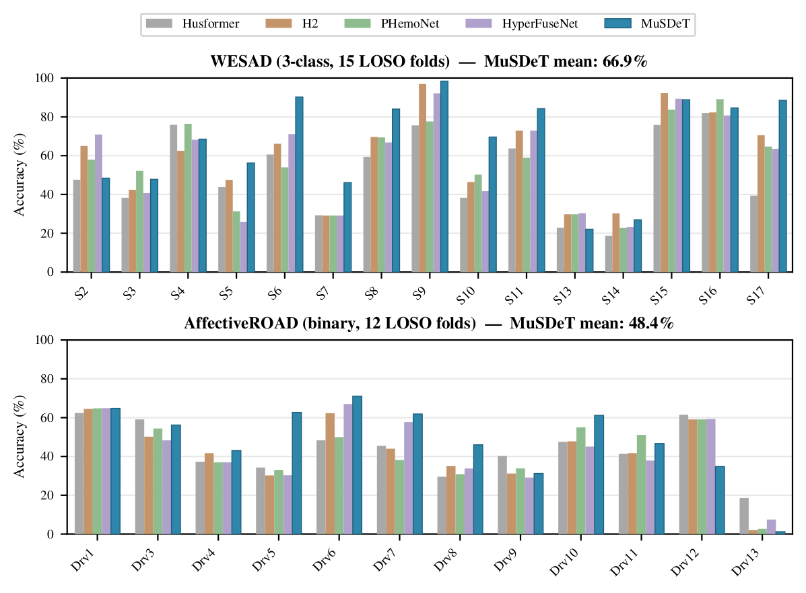
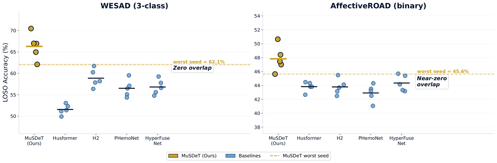
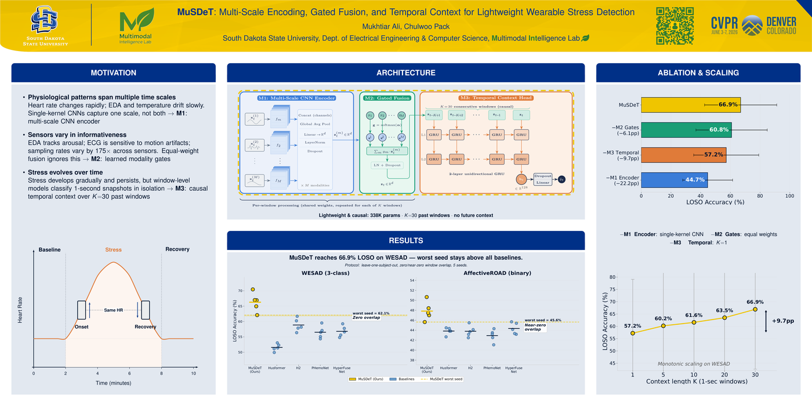

# MuSDeT: Multimodal Stress Detection with Temporal Context

<p align="center"><b>Multi-Scale Encoding, Gated Fusion, and Temporal Context for Lightweight Wearable Stress Detection</b><br>
Mukhtiar Ali &nbsp;·&nbsp; Chulwoo Pack<br>
MULA Workshop @ CVPR 2026</p>

<p align="center">
  <a href="https://openaccess.thecvf.com/content/CVPR2026W/MULA2026/papers/Ali_Multi-Scale_Encoding_Gated_Fusion_and_Temporal_Context_for_Lightweight_Wearable_CVPRW_2026_paper.pdf"></a>
  <a href="https://openaccess.thecvf.com/content/CVPR2026W/MULA2026/html/Ali_Multi-Scale_Encoding_Gated_Fusion_and_Temporal_Context_for_Lightweight_Wearable_CVPRW_2026_paper.html"></a>
  
  <a href="LICENSE"></a>
  
</p>

Official implementation of **"Multi-Scale Encoding, Gated Fusion, and Temporal Context for Lightweight Wearable Stress Detection"** (MULA Workshop at CVPR 2026).

## 1-minute teaser

<p align="center">
  <a href="https://github.com/Multimodal-Intelligence-Lab/MuSDeT/releases/download/v1.0/musdet-teaser.mp4"></a>
</p>

## Overview

MuSDeT is a lightweight three-stage architecture (~338K parameters) for wearable stress detection under leave-one-subject-out (LOSO) evaluation:

1. **Multi-scale CNN encoder** — per-modality parallel 1D CNNs at multiple kernel sizes
2. **Gated fusion** — softmax-normalized learnable importance weights combining modality embeddings
3. **GRU temporal context head** — 2-layer unidirectional GRU processing K=30 consecutive fused embeddings

<p align="center">
  
</p>

## Results

### Comparison with baselines (LOSO, balanced class weights)

| Model | Params | WESAD Acc | WESAD F1 | AR Acc | AR F1 |
|-------|--------|-----------|----------|--------|-------|
| **MuSDeT (Ours)** | **338K** | **66.9** | **58.3** | **48.4** | 36.5 |
| Husformer | 478K | 51.4 | 42.3 | 43.8 | **37.4** |
| H2 | 15.7M | 60.2 | 49.1 | 42.5 | 34.3 |
| PHemoNet | 2.4M | 56.5 | 47.1 | 42.5 | 35.7 |
| HyperFuseNet | 6.6M | 57.8 | 48.0 | 43.2 | 35.9 |

MuSDeT reports the best accuracy on both datasets and the best WESAD macro-F1, using up to 46× fewer parameters than the baselines.

<p align="center">
  
</p>

### Seed robustness (n=5 seeds)

| Model | WESAD Acc | AR Acc |
|-------|-----------|--------|
| **MuSDeT** | **66.3 +/- 2.7** | **47.8 +/- 1.7** |
| Husformer | 51.6 +/- 1.1 | 43.8 +/- 0.6 |
| H2 | 58.9 +/- 1.9 | 43.8 +/- 1.0 |

<p align="center">
  
</p>

## Setup

### Requirements

```bash
pip install -r requirements.txt
```

### Data preparation

- **WESAD**: [Download from UCI](https://archive.ics.uci.edu/dataset/465/wesad+wearable+stress+and+affect+detection)
- **AffectiveROAD**: [Download from MIT Media Lab](https://www.media.mit.edu/tools/affectiveroad/)

After downloading, preprocess into LOSO folds:

```bash
python -m src.datasets.preprocessing.parse_raw_wesad --data_dir /path/to/WESAD
python -m src.datasets.preprocessing.parse_raw_affectiveroad --data_dir /path/to/AffectiveROAD
python -m src.datasets.preprocessing.create_wesad_loso_folds
python -m src.datasets.preprocessing.create_affectiveroad_loso_folds
```

Place the processed data in `data/wesad/` and `data/affectiveroad/`.

## Training

### MuSDeT

```bash
python -m src.train --config configs/wesad/musdet.yaml
python -m src.train --config configs/wesad/musdet.yaml --fold 0 --epochs 1  # single fold test
python -m src.train --config configs/wesad/musdet.yaml --seed 123            # different seed
```

### Baselines

```bash
python -m src.train --config configs/wesad/husformer.yaml
python -m src.train --config configs/wesad/h2.yaml
python -m src.train --config configs/wesad/phemonet.yaml
python -m src.train --config configs/wesad/hyperfusenet.yaml
```

### Ablation study (Table 2)

```bash
python -m src.train --config configs/wesad/no_encoder.yaml
python -m src.train --config configs/wesad/no_gates.yaml
python -m src.train --config configs/wesad/no_temporal.yaml   # K=1, identity head
```

### Context length sweep (Table 3)

```bash
python -m src.train --config configs/wesad/ctx5.yaml
python -m src.train --config configs/wesad/ctx10.yaml
python -m src.train --config configs/wesad/ctx20.yaml
```

Replace `wesad` with `affectiveroad` for the AffectiveROAD dataset.

## Project structure

```
MuSDeT/
├── configs
│   ├── wesad
│   │   ├── musdet.yaml
│   │   ├── husformer.yaml
│   │   ├── h2.yaml
│   │   ├── phemonet.yaml
│   │   ├── hyperfusenet.yaml
│   │   ├── no_encoder.yaml
│   │   ├── no_gates.yaml
│   │   ├── no_temporal.yaml
│   │   ├── ctx5.yaml
│   │   ├── ctx10.yaml
│   │   └── ctx20.yaml
│   └── affectiveroad
│       └── ...
├── src
│   ├── train.py
│   ├── models
│   │   ├── coinfo_gru.py
│   │   ├── husformer.py
│   │   ├── h2.py
│   │   ├── phemonet.py
│   │   ├── hyperfusenet.py
│   │   └── modules
│   │       ├── window_encoders.py
│   │       ├── fusion.py
│   │       └── temporal_heads.py
│   ├── datasets
│   └── evaluation
├── scripts
│   ├── plot_perfold_all_models.py
│   ├── extract_and_plot_tsne.py
│   ├── aggregate_multiseed.py
│   └── export_tables.py
├── assets                  # figures used in this README
├── requirements.txt
└── LICENSE
```

## Poster

Presented at the MULA Workshop, CVPR 2026. [Download the full poster (PDF)](https://github.com/Multimodal-Intelligence-Lab/MuSDeT/releases/download/v1.0/musdet-cvpr-poster.pdf).

<p align="center">
  <a href="https://github.com/Multimodal-Intelligence-Lab/MuSDeT/releases/download/v1.0/musdet-cvpr-poster.pdf"></a>
</p>

## Citation

```bibtex
@inproceedings{ali2026multi,
  title={Multi-Scale Encoding, Gated Fusion, and Temporal Context for Lightweight Wearable Stress Detection},
  author={Ali, Mukhtiar and Pack, Chulwoo},
  booktitle={Proceedings of the IEEE/CVF Conference on Computer Vision and Pattern Recognition},
  pages={7454--7462},
  year={2026}
}
```

## License

MIT License. See [LICENSE](LICENSE) for details.
